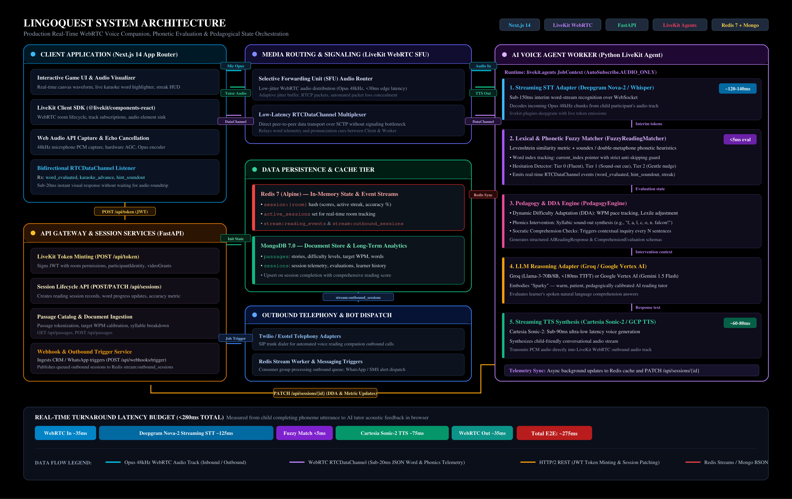

# LingoQuest Kids — Real-Time AI Voice Reading Companion

An interactive, voice-driven literacy platform for young readers (ages 7+). Kids read stories aloud into their microphone while an AI companion listens in real time, highlights each word as they speak, and coaches them through tricky pronunciations — all with sub-300ms latency.

Built with LiveKit WebRTC, Deepgram Nova-2 streaming STT, Cartesia Sonic-2 TTS, and Google Gemini 2.5 Flash.



---

## Why This Exists

Traditional reading apps test comprehension through silent multiple-choice quizzes *after* the child reads. They completely miss **reading fluency** — the combination of:

1. **Speed & Automaticity** — Instant word recognition without long pauses
2. **Phonetic Accuracy** — Correct pronunciation of digraphs, blends, and silent letters
3. **Confidence & Expression** — Reading aloud with natural rhythm

Measuring fluency has historically required a human tutor sitting beside the child. LingoQuest turns the microphone into a primary learning controller with real-time word-level feedback.

---

## How It Works

```
  ┌───────────────────────────────────────────────────────┐
  │ 1. Story displayed on screen:                         │
  │    "The brave knight walked into the dark cave."      │
  └───────────────────────────┬───────────────────────────┘
                              │
                              ▼
  ┌───────────────────────────────────────────────────────┐
  │ 2. Child reads aloud into mic (streamed via WebRTC)   │
  └───────────────────────────┬───────────────────────────┘
                              │
             ┌────────────────┴────────────────┐
             ▼                                 ▼
  ┌────────────────────────┐        ┌────────────────────────┐
  │ Correct!               │        │ Hesitated > 3 seconds  │
  │ Word glows green ✓     │        │ AI sounds it out:      │
  │ XP + streak go up      │        │ "k - n - i - g - h - t"│
  │ Story advances          │        │ Phoneme card displayed │
  └────────────────────────┘        └────────────────────────┘
```

After every few sentences, the AI asks an open-ended comprehension question (*"Why do you think the knight was afraid?"*) and evaluates the child's spoken response conversationally.

---

## Architecture

The system maintains a sub-300ms end-to-end latency budget from microphone input to screen highlight:

| Pipeline Stage | Technology | Measured Latency |
| :--- | :--- | :--- |
| Audio Capture & Encoding | WebRTC Opus 48kHz | ~35ms |
| Network Transport | LiveKit UDP SFU | ~50ms |
| Streaming Transcription | Deepgram Nova-2 | ~170ms |
| Phonetic Evaluation | Levenshtein + Soundex | ~2ms |
| Data Channel Downlink | WebRTC SCTP | ~30ms |
| DOM State Update | React + Tailwind | ~16ms |
| **Total Round-Trip** | | **~280ms** |

### Key Design Decisions

- **WebRTC over WebSockets** — UDP-based RTP avoids TCP head-of-line blocking, enabling real-time barge-in and interruption handling ([ADR-001](docs/decisions/ADR-001-webrtc-livekit-pipeline.md))
- **Dual Phonetic Scoring** — Levenshtein distance combined with Soundex hash handles child speech patterns (soft-g substitutions, stutter repetitions) without false negatives ([ADR-002](docs/decisions/ADR-002-phonetic-fuzzy-matching.md))
- **Generative Dungeon Master** — Gemini 2.5 Flash generates the next story sentence dynamically based on the child's reading level, rather than using static passages ([ADR-003](docs/decisions/ADR-003-generative-dungeon-master.md))
- **Non-Punitive Hesitation** — 3-second silence triggers a gentle phoneme breakdown and TTS pronunciation instead of a failure state ([ADR-004](docs/decisions/ADR-004-voice-hints-and-phoneme-breakdown.md))
- **Dynamic Difficulty Adjustment** — WCPM and accuracy metrics classify the reader into Independent (≥95%), Instructional (90-94%), or Frustrational (<90%) levels, scaling Lexile difficulty in real time ([ADR-005](docs/decisions/ADR-005-dynamic-difficulty-and-comprehension.md))

---

## Monorepo Structure

```
reading-game-monorepo/
├── apps/
│   ├── web/                    # Next.js 14 App Router + TailwindCSS + LiveKit React
│   ├── api/                    # FastAPI — session CRUD, LiveKit token minting, webhooks
│   └── voice-worker/           # Python LiveKit voice agent — STT, TTS, fuzzy matcher, pedagogy
│
├── packages/
│   ├── shared-types/           # TypeScript DTOs shared across frontend
│   ├── ui/                     # Reusable React components (audio waveform visualizer)
│   └── eslint-config/          # Shared linting rules
│
├── docs/
│   ├── architecture.md         # Detailed architecture & latency budget
│   └── decisions/              # Architecture Decision Records (ADR-001 through ADR-005)
│
├── docker-compose.yml          # Full stack orchestration
├── turbo.json                  # Turborepo pipeline config
└── pnpm-workspace.yaml         # pnpm workspace root
```

---

## Quick Start

### Prerequisites
- **Docker Desktop** installed and running
- GCP service account key file placed in root directory
- `.env` file populated (see `.env.example`)

### Run

```bash
docker compose up -d
```

Check health:
```bash
docker compose ps
```

| Container | Role | Access |
| :--- | :--- | :--- |
| `reading-game-web` | Next.js Frontend | [localhost:3000](http://localhost:3000) |
| `reading-game-api` | FastAPI Backend | [localhost:8000](http://localhost:8000/docs) |
| `reading-game-voice-worker` | LiveKit Voice Agent | Connected to LK Cloud |
| `reading-game-mongo` | MongoDB 7.0 | localhost:27018 |
| `reading-game-redis` | Redis 7 | localhost:6379 |

---

## Playing the Game

1. Open [localhost:3000](http://localhost:3000) and pick a character
2. Select a reading quest and click **Start Reading Quest**
3. The AI tutor greets you — read the glowing word into your microphone
4. Words turn green as you read them correctly; XP and streak counters go up
5. Pause on a tricky word for 3 seconds — the tutor sounds it out for you
6. After completing a sentence, answer the tutor's comprehension question
7. The story continues with dynamically generated text matching your reading level

---

## Tech Stack

| Layer | Technology |
| :--- | :--- |
| Frontend | Next.js 14, TypeScript, TailwindCSS, LiveKit React SDK |
| Voice Transport | LiveKit WebRTC (Opus 48kHz, Data Channels) |
| Speech-to-Text | Deepgram Nova-2 Streaming (word-level timestamps) |
| Text-to-Speech | Cartesia Sonic-2 (<100ms TTFB) |
| LLM | Google Gemini 2.5 Flash via Vertex AI |
| Backend API | FastAPI (Python) |
| Databases | MongoDB 7.0 (sessions & analytics), Redis 7 (state & streams) |
| Infrastructure | Docker Compose, Turborepo, pnpm workspaces |

---

## License

MIT
