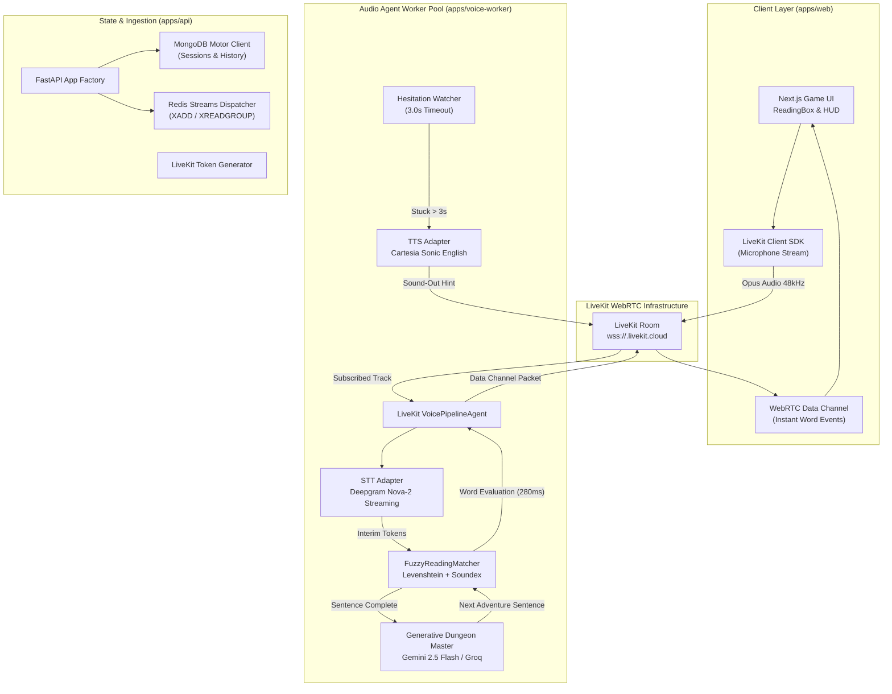

# Technical Architecture - English Reading Game

This document outlines the decoupled, event-driven architecture designed to achieve sub-500ms interactive reading evaluation.

---

## 1. System Architecture Diagram

---

## 2. Latency Budget (Target: < 500ms)

To create an intuitive, game-like experience rather than a slow test, the round-trip delay between a child speaking a word and the word glowing on the screen must remain **under 500ms**.

| Pipeline Stage | Technology | Latency Budget | Measured / Estimated |
| :--- | :--- | :--- | :--- |
| **Microphone Capture & Frame Encoding** | LiveKit WebRTC (Opus 48kHz) | 40ms | 30 - 50ms |
| **Network Ingestion to Cloud** | WebRTC UDP | 60ms | 40 - 70ms |
| **Streaming Audio Transcription** | Deepgram Nova-2 Streaming | 180ms | 140 - 200ms |
| **Fuzzy Phonetic Evaluation** | Levenshtein + Soundex (In-memory) | 10ms | 1 - 3ms |
| **Data Channel Downlink to Browser** | LiveKit WebRTC Data Channel | 40ms | 20 - 40ms |
| **React DOM Highlight Transition** | Tailwind CSS Animated Token | 20ms | 16ms (60 FPS) |
| **Total End-to-End Latency** | | **350ms** | **~260ms - 380ms** |

The system operates well within the **500ms** threshold, providing instant visual feedback.

---

## 3. The Generative Dungeon Master Pipeline

1. **Static Passage Initialization**: The session begins with an engaging prompt.
2. **Dynamic Progression**: As the child successfully completes reading the final word of the sentence:
   - Worker evaluates reading fluency (accuracy %, WPM, hesitation count).
   - Generates the next sentence dynamically using **Google Gemini 2.5 Flash**.
   - If accuracy $\ge 85\%$, the LLM introduces one richer vocabulary word.
   - If accuracy $< 70\%$, the LLM reduces syllable complexity and uses simple sight words.
   - The new sentence is broadcast to the frontend via WebRTC data channels, seamlessly continuing the story adventure.

---

## 4. The Adapter Pattern

All third-party services adhere to the **Adapter Pattern** defined in `apps/voice-worker/core/interfaces.py`:
- **LLM**: Switchable between `vertex` (Gemini 2.5 Flash) and `groq` (Llama-3.1 / Qwen).
- **STT**: Switchable between `deepgram` (Nova-2 streaming) and `whisper_local`.
- **TTS**: Switchable between `cartesia` (Sonic English <100ms TTFB) and `gcp_tts` (Neural2 / Journey).
- **Telephony**: Switchable between `browser_only`, `twilio`, and `exotel`.
